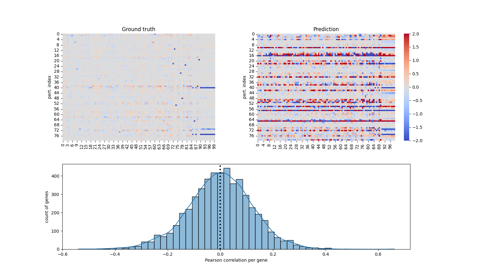
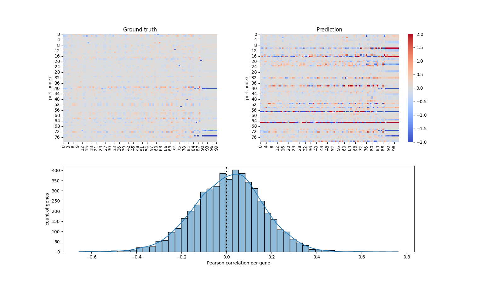

# Summary
---

This is a short report on different trained models and their results.

## Glossary

- SDiff: Single diffusion
- RWR: Random-walk restart
- LOO: leave-one-out

## SDiff RWR - LOO - Ridge: sdiffrwr_loo_ridge

- Fix parameters: `alpha_RW = 0.85`, `score_threshold = 0.5`, `variance_percentile = 80`, `n_latent = 70`

- Mean gene correlation (Pearson correlation): -0.001 (Gaussian centered around mean, see Figure)

> Observations: random predictions on most genes (see Figure)

## SDiff RWR - LOO - Ridge + ElasticNet: sdiffrwr_loo_ridge_enet (CV = 0.14, LB = -0.35)

- Fix parameters: `alpha_RW = 0.75`, `score_threshold = 0.5`, `variance_percentile = False`, `n_latent = 35`

